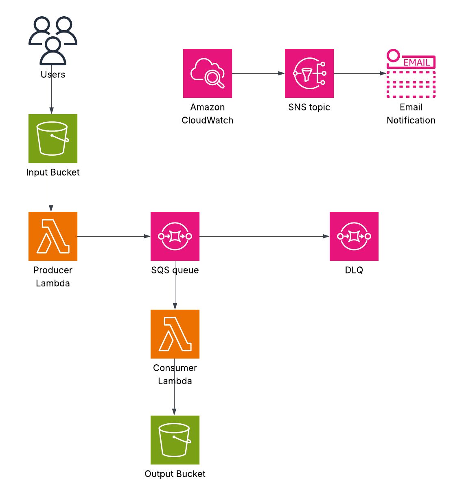

# A Simple SQS Example

A simple example of how to implement Lambda functions for SQS producers and consumers.

## Architecture



1. Files are uploaded to an input S3 bucket.
2. An S3 notification triggers the execution of the producer Lambda function.
3. The producer Lambda function processes the S3 object and writes a message to the SQS queue.
4. A Lambda trigger causes the consumer Lambda function execution when a message is put on the queue.
5. The consumer Lambda function processes the message and writes an S3 object to the output bucket.

A DLQ has been configured for the SQS queue.

CloudWatch alarms are deployed to monitor the Lambda functions and SQS queues.

## Go Task

[Go Task](https://github.com/go-task/task) is used make the execution of routine commands easier.

To see a list of what tasks have been configured, execute `task --summary`.  To see more detail for a particular task, execute `task <task_name> --summary`.  YOu can also have a look at the `Taskfile.yml` file to see even more detail.

## Pre-commit

[Pre-commit](https://pre-commit.com/) hooks have been configured for this repository.

You can look at which hooks have been configured by examining the `.pre-commit-config.yaml` file.

To install the pre-commit hooks run `task install-precommit`.  Once installed, the hooks will run whenever a `git commit` command is executed.

Some of the hooks have their own configuration files:
- [Gitleaks](https://github.com/gitleaks/gitleaks) has a [.gitleaks.toml](./.gitleaks.toml) file
- [checkov](https://www.checkov.io/) has a [.checkov.yml](./.checkov.yml) file
- [tflint](https://github.com/terraform-linters/tflint) has a [.tflint.hcl](./.tflint.hcl) file
- [Bandit](https://bandit.readthedocs.io/en/latest/) has a [.bandit.yml](./.bandit.yml) file
- [flake8](https://flake8.pycqa.org/en/latest/) has a [.flake8](./.flake8) file

## Poetry

[Poetry](https://python-poetry.org/) is used to manage Python dependencies for the Lambda functions.

### poetry-plugin-lambda-build

The [poetry-plugin-lambda-build](https://pypi.org/project/poetry-plugin-lambda-build/) plugin allows you to easily create ZIP archives of your Lambda functions.

To install the plugin for a particular Lambda function, execute the following:

```bash
cd lambdas/my-lambda/
poetry self add poetry-plugin-lambda-build
```

To build a Poetry package (i.e. ZIP archive) for one of the Lambda functions, you can either run the command directly, or run a task:

```bash
# run the command directly
cd lambdas/my-lambda/
poetry build-lambda

# run the task
cd lambdas/my-lambda/
task build
```

## Pytest

[Pytest](https://docs.pytest.org/en/stable/) tests have been configured for the Lambdas.

## Terraform

The AWS resources are deployed via Terraform.

To run a plan to see what resources Terraform plans to deploy, execute `task plan`.  To deploy the AWS resources, execute `task deploy`.  Note: this will also build the Lambda function packages as they are required by the Lambda function Terraform resource.

## CI/CD

Terraform code exists in the repo to deploy a CodeBuild project along with a webhook.  The [buildspec.yml](./cicd/buildspec.yml) file contains commands that will be run for each CodeBuild execution.

## Utility Scripts

The `scripts/write-to-s3.py` script allows for quick creation and uploading of JSON files to the input S3 bucket.
